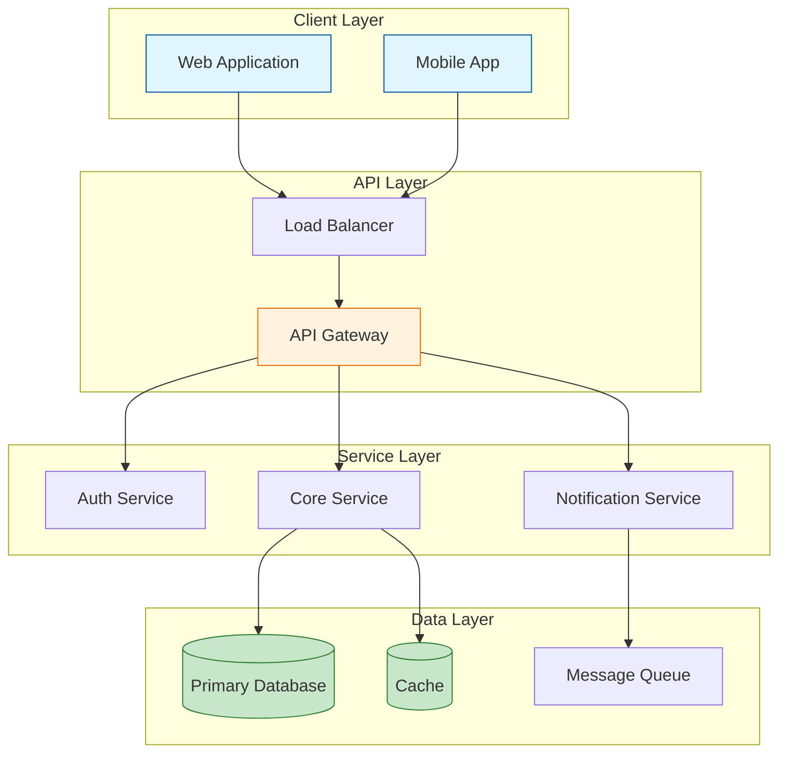
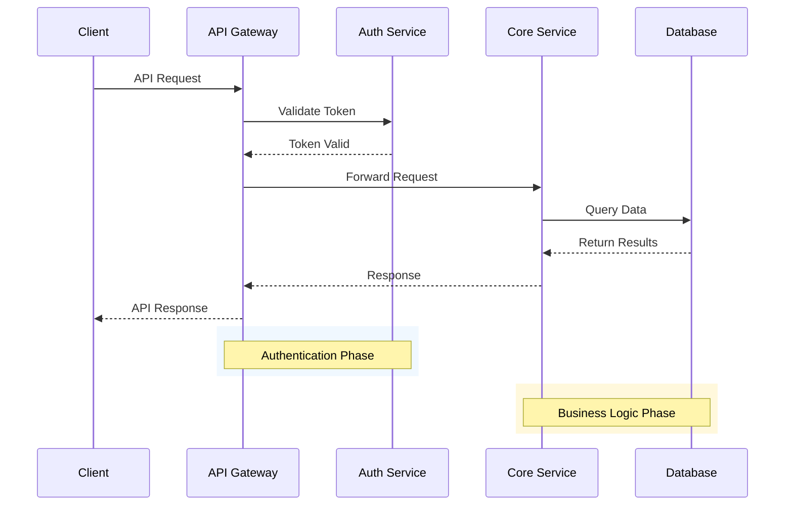
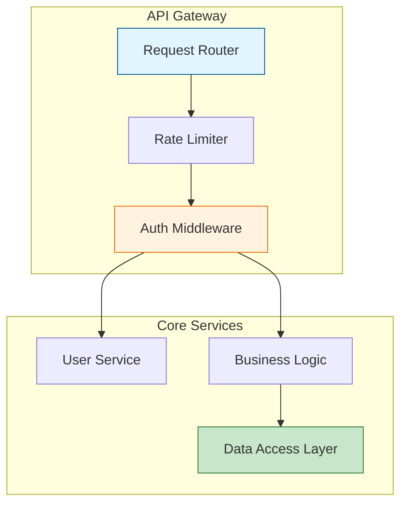
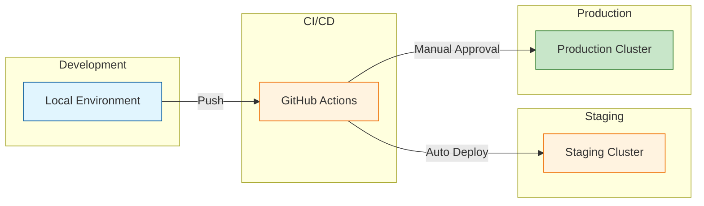
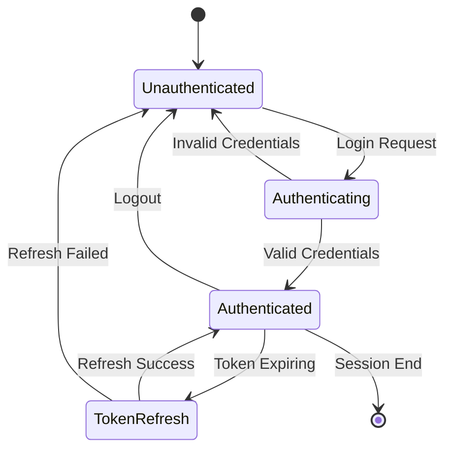

# Architecture Documentation

<!-- This is a placeholder template for architecture documentation. Update with your project's specific architecture. -->

## System Overview

<!-- Provide a high-level description of the system's purpose and scope. -->

This document describes the architecture of [PROJECT_NAME].

### Purpose

<!-- What problem does this system solve? What are its main responsibilities? -->

### Scope

<!-- What is included and excluded from this system's boundaries? -->

## Architecture Diagram

<!-- Replace these example diagrams with your project's actual architecture. -->

### High-Level System Architecture



### Request Flow Sequence



## Components

<!-- List and describe major components of the system. -->

### Component Overview



### Component 1

**Purpose:** <!-- Brief description -->

**Responsibilities:**

- <!-- Responsibility 1 -->
- <!-- Responsibility 2 -->

**Dependencies:**

- <!-- Dependency 1 -->

### Component 2

<!-- Repeat pattern for additional components -->

## Data Flow

<!-- Describe how data moves through the system. -->

### Input

<!-- How does data enter the system? -->

### Processing

<!-- How is data transformed or processed? -->

### Output

<!-- How does data leave the system? -->

## Technology Stack

<!-- List the technologies used in this project. -->

| Layer | Technology | Purpose |
|-------|------------|---------|
| Frontend | <!-- e.g., React, Vue, Angular --> | User interface |
| Backend | <!-- e.g., Node.js, Python, Go --> | API server |
| Database | <!-- e.g., PostgreSQL, MongoDB --> | Data persistence |
| Cache | <!-- e.g., Redis, Memcached --> | Performance optimization |
| Queue | <!-- e.g., RabbitMQ, SQS --> | Async processing |

## Deployment Architecture

<!-- Describe how the system is deployed. -->

### Environment Overview



### Environments

- **Development**: Local development environment with hot reloading
- **Staging**: Pre-production environment mirroring production configuration
- **Production**: Live environment with high availability and monitoring

### Infrastructure

<!-- Describe hosting, containerization, orchestration, etc. -->

## Security Considerations

<!-- Document security architecture decisions. -->

### Authentication Flow



### Authentication

<!-- How are users/services authenticated? -->

### Authorization

<!-- How are permissions managed? -->

### Data Protection

<!-- How is sensitive data protected? -->

## Architecture Decision Records (ADRs)

<!-- Document significant architecture decisions using ADR format. -->

### ADR-001: [Decision Title]

**Status:** <!-- Proposed | Accepted | Deprecated | Superseded -->

**Context:** <!-- What is the issue motivating this decision? -->

**Decision:** <!-- What is the change being proposed? -->

**Consequences:** <!-- What are the results of this decision? -->

---

### ADR Template

Use this template for new architecture decisions:

```markdown
### ADR-XXX: [Decision Title]

**Status:** Proposed

**Date:** YYYY-MM-DD

**Context:**
[Describe the forces at play, including technical, business, and social factors]

**Decision:**
[Describe the change being proposed or the response to the forces]

**Consequences:**
[Describe the resulting context after applying the decision]

**Alternatives Considered:**
- [Alternative 1]: [Why not chosen]
- [Alternative 2]: [Why not chosen]
```

## Maintenance Guidelines

### Keeping This Document Updated

- Update this document when significant architecture changes occur
- Review quarterly for accuracy
- Include architecture discussions in PR reviews for relevant changes
- Link to this document from code comments when implementing architectural patterns

### Related Documentation

- [Development Guide](development.md) - Local setup and development workflow
- [Contributing Guidelines](../CONTRIBUTING.md) - How to contribute to this project
- [AI Agent Guidelines](../AGENTS.md) - Context for AI assistants

---

> **Note:** This is a placeholder template. Replace the content above with your project's actual architecture documentation.
